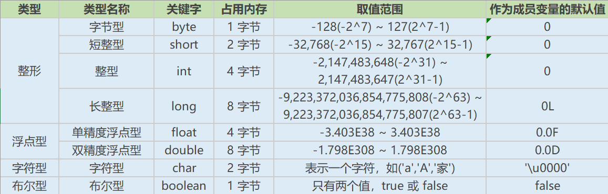
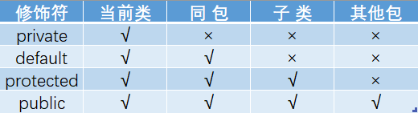
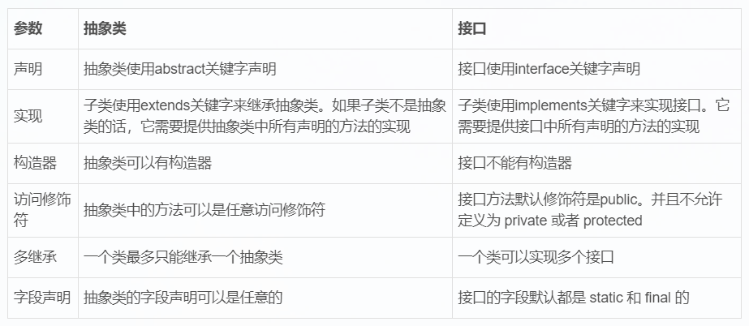

# 一、Java基础
## 1.1 何为编程
编程就是让计算机为解决某个问题而使用某种程序设计语言编写程序代码，并最终得到结果的过程。<br>
为了使计算机能够理解人的意图，人类就必须要将需要解决的问题的思路、方法和手段通过计算机能理解的形式告诉计算机
，使得计算机能够根据人的指令一步一步去工作，完成某种特定的任务。这种人和计算机之间交流的过程就是编程。<br>

## 1.2 什么是Java
Java是一种面向对象的语言，不仅吸收了C++语言的各种优点，还摒弃了C++里难以理解的多继承、指针等概念，
因此Java语言具有功能强大和简单已用两个特征。Java语言作为静态面向对象编程语言的代表，极好地实现了面向对象
理论，允许程序员以优雅的思维方式进行复杂的编程。<br>

## 1.3 jdk1.5之后的重要版本
### (1) Java SE (J2SE, Java 2 Platform Standard Edition, 标准版)
Java SE 以前称为 J2SE。它允许开发和部署在桌面、服务器、嵌入式环境和实时环境中使用的Java应用程序。Java
SE 包含了Java Web 服务开发的类，并为Java EE 和 Java ME 提供基础。

### (2) Java EE (J2EE, Java 2 Platform Enterprise Edition, 企业版)
Java EE 以前称为 J2EE。企业版本帮助开发和部署可移植、见状、可伸缩且安全的服务器端Java应用程序。Java EE
是在 Java SE 的基础上构建的，它提供Web服务、组件模型、管理和通信API，可以用来实现企业级的面向服务体系结构
（service-oriented architecture, SOA）和Web2.0应用程序。2018年2月，Eclipse 宣布正式将 JavaEE 更名
为JakartaEE

### (3)Java ME (J2ME， Java 2 platform Micro Edition, 微型版)
Java ME 以前称为 J2ME。Java ME 为在移动设备和嵌入式设备（比如手机、PDA、电视机顶盒和打印机）上运行的
应用程序提供一个健壮且灵活的环境。Java ME 包括灵活的用户界面、健壮的安全模型、许多内置的网络协议以及对
可以动态下载的连网和离线应用程序的丰富支持。基于Java ME 规范的应用程序只需编写一次，就可以用于许多设备，
而且可以利用每个设备的本机功能。

### (4) todo 
之后的jdk1.8 jdk11, jdk17, jdk21, jdk25 都是重要的版本

## 1.4 JVM、JRE 和 JDK 的关系
### (1) JVM
Java Virtual Machine 是Java虚拟机，Java程序需要运行在虚拟机上，不同的平台有自己的虚拟机，因此Java语言可以
实现跨平台。

### (2) JRE
Java Runtime Environment 包括Java虚拟机和Java程序所需的核心类库等。核心类库主要是java.lang包：包含了运行
Java程序必不可少的系统类，如基本数据类型、基本数学函数、字符串处理、线程、异常处理类等，该包由 JVM 在程序启动时
自动导入，无需显式使用 import java.lang.*; 语句，因此被称为“默认加载”或“隐式导入”的包。
如果想要运行一个开发好的Java程序，计算机总只需要安装JRE即可。

### (3) JDK
JDK（Java Development Kit，Java开发工具包）是提供给Java人员使用的，其中包含了Java的开发工具，也包括了JRE，
JDK提供了Java开发所需的所有工具：如编译工具(javac.exe)，打包工具(jar.exe)，javadoc，javap，javah，javap 等。

### (4) JVM & JRE & JDK 关系图


## 1.5 什么是跨平台性？原理是什么
所谓跨平台性，是指java语言编写的程序，一次编译后，可以在多个系统平台上运行。<br>
实现原理：Java程序是通过java虚拟机在系统平台上运行的，只要该系统可以安装相应的java虚拟机，该系统就可以运行
java程序。


## 1.6 Java语言特点
- 简单易学（Java语言的语法与C语言的C++语言很接近）
- 面向对象（封装，继承，多态）
- 平台无关性（Java虚拟机实现平台无关性）
- 支持网络编程并且很方便（Java语言诞生本身就是为简化网络编程设计的）
- 支持多线程（多线程机制使应用程序在同一时间并行执行多项任务）
- 健壮性（Java语言的强类型机制、异常处理、垃圾的自动收集等）
- 安全性

## 1.7 什么是字节码，使用字节码的好处?
<Strong>字节码：</Strong>
Java源代码经过虚拟机编译器编译后产生的文件（即扩展为.class的文件），它不面向任何特定的处理器，只面向
虚拟机。<br><br>

<Strong>采用字节码好处：</Strong>
Java语言通过字节码的方式，在一定程度上解决了传统解释性语言执行效率低的问题，同时又保留了解释性语言可移植
的特点。所以Java程序运行时比较高效，而且，由于字节码并不专对一种特定的机器，因此，Java程序无须重新编译
便可在多种不同的计算机上运行。<br><br>

<Strong>Java代码执行流程：</Strong>
Java源代码--->Java编译器--->jvm可执行的Java字节码(即虚拟指令)--->jvm--->jvm中的解释器--->机器可
执行的二进制机器码--->程序运行

## 1.8 什么是Java程序的主类？应用程序和小程序的主类有什么不同?
一个程序中可以有多个类，但只能有一个类是主类。在Java应用程序中，这个主类是指包含main()方法的类。而在
Java小程序中，这个主类是一个继承自系统类JApplet或Applet的子类。应用程序的主类不一定要求是public类，
但小程序的主类要求必须是public类。主要是Java程序执行的入口点。


## 1.9 Java应用程序与小程序之间的区别?
简单来说应用程序是从主线程启动(也就是main()方法)。applet小程序没有main方法，主要是嵌在浏览器页面上运行
（调用init()线程或者run()来启动），嵌入浏览器这点跟flash的小游戏类似。

## 1.10 Java和C++的区别?
虽然很多人都没学过C++，但是有些面试官就喜欢拿Java和C++进行对比，所以这里简单说一下JDK和C++的区别。
- 都是面向对象的语言，都支持封装、继承和多态
- Java不提供指针来直接访问内存，程序内存更加安全
- Java的类是单继承的，C++支持多重继承；虽然Java的类不可以多继承，但是接口可以多继承
- Java有自动内存管理机制，不需要程序员手动释放无用内存

## 1.11 Oracle JDK 和 OpenJDK 的区别？
1.Oracle JDK版本每三年发布一次，OpenJDK版本每三个月发布一次。<br>
2.OpenJDK是一个参考模型并且完全开源的，Oracle JDK是OpenJDK的实现，并不是完全开源的。<br>
3.Oracle JDK 比OpenJDK更稳定。OpenJDK 和 Oracle JDK 的代码几乎相同，但Oracle JDK有更多的类和一些错误
修复。因此，商用推荐Oracle JDK，个人推荐OpenJDK。<br>
4.在响应性和JVM性能方面，Oracle JDK 与OpenJDK相比提供了更好的性能。<br>
5.Oracle JDK 不会为即将发布的版本提供长期支持，用户每次都必须通过更新到最新版本来获取支持。<br>
6.Oracle JDK 根据二进制代码许可协议获得许可，而OpenJDK根据GPL v2获得许可。<br>
7.时至今日，Oracle JDK 宣称要全面收费了，许多公司已弃用。<br>


# 二、基础语法
## 2.1 Java有哪些数据类型
<Strong>定义：</Strong>
Java语言是强类型语言，对于每一种数据都定义了明确的具体的数据类型，在内存中分配了不同大小的内存空间。

### 分类
（1）基本数据类型<br>
数值型：整数类型（byte,short,int,long），浮点类型（float,double）<br>
字符型(char)<br>
布尔型(boolean)<br>

（2）引用数据类型<br>
类（class）<br>
接口（interface）<br>
数组（[]）

### Java基本数据类型图


### switch可操作的数据类型
在Java5以前，switch(expr)中，expr只能是byte,short,char,int。从Java5开始，Java中引入了枚举类型，expr也可以
是enum类型，从Java7开始，expr还可以是字符串(String)，但是长整型（long）在目前所有的版本中都是不可以的。

### 用最有效率的方法计算2乘以8
2<<3（左移3位相当于乘以2的3次方，右移3位相当于除以2的3次方）。<br>
Math.round(11.5)等于多少？Math.round(-11.5)等于多少<br>
Math.round(11.5)等于12，Math.round(-11.5)等于-11。四舍五入的原理是在参数上加0.5，然后进行下取整。

### float f =3.4;是否正确
不正确。3.4是双精度数，将双精度数（double）赋值给浮点型（float）属于下转型（down-casting，也称为窄化）会
造成精度损失，因此需要强制类型转成 float f = (float) 3.4; 或者写成 float f = 3.4F;<br>

<Strong>PS: 字面量默认类型</Strong><br>
在 Java 中，所有小数形式的浮点数字面量（如 3.4、0.1、-2.5）默认都是 double 类型。<br>
如果你想表示 单精度（float），必须显式加上后缀 f 或 F。<br>

### short s1 = 1; s1 = s1 + 1;有错吗？short s1 = 1;s1 +=1;有错吗
对于 short s1 = 1; s1 = s1 + 1; 由于1是int类型，因此 s1+1 运算结果也是int类型，需要强制转换类型才能赋值给
short 类型.<br>
而short s1 = 1; s1 +=1; 可以正确编译，因为 s1 += 1; 相当于 s1 = (short)(s1 + 1); 其中有隐含的强制类型转换。

## 2.2 编码
### Java采用什么编码，有何特点？
Java语言采用Unicode编码标准，Unicode（标准码），它为每个字符制订了一个唯一的数值，因此在任何的语言，平台
程序都可以放心的使用。

## 2.3 Java注释
### 什么是Java注释
<Strong>定义:</Strong>
用于解释说明程序的文字<br>
<Strong>分类:</Strong>
- 单行注释：//
- 多行注释：/* */
- 文档注释：/** */

<br><br>
<Strong>作用</Strong>
在程序中，尤其是复杂的程序中，适当地加入注释可以增加程序的可读性，有利于程序的修改、调试和交流。注释的
内容在程序编译的时候会被忽视，不会产生目标代码，注释的部分不会对程序的执行结果产生任何影响。<br>
注意事项：多行和文档注释都不能嵌套使用

<Strong>PS:</Strong>
有些语言的API可以读取注释内容，如Python，但尽量避免使用，以防有人更改、删除注释对程序造成影响。


## 2.4 访问修饰符
### 访问修饰符 public,private,protected,以及不写（default）时的区别
<Strong>定义：</Strong>
Java中，可以使用访问修饰符来保护对类、变量、方法和构造方法的访问。Java支持4种不同的访问权限。<br>
<Strong>分类</Strong><br>
private:在同一类内可见。使用对象：变量、方法。注意：不能修饰类（外部类）
default(即缺省，什么也不写，不适用任何关键字):在同一包内可见，不适用任何修饰符。使用对象：类、接口、变量、方法。<br>
protected:对同一包内的类和所有子类可见。使用对象：变量、方法。注意：不能修饰类（外部类）。<br>
public: 对所有类可见。使用对象：类、接口、变量、方法。

### 访问修饰符图



## 2.5 运算符
### & 和 &&的区别
&运算符有两种用法：（1）按位与;（2）逻辑与。<br><br>

&&运算符是短路与运算。逻辑与跟短路与的差别是非常巨大的，虽然二者都要求运算符左右两端的布尔值都是true，整个
表达式的值才是true。&&之所以称为短路运算，是因为如果&&左边的表达式的值是false，右边的表达式会被直接短路掉，不会进行运算。<br>

<Strong>注意：逻辑或运算符（|）和短路或运算符（||）的差别也是如此 。</Strong>


## 2.6 关键字

### Java有没有goto
goto是java的保留字，在目前版本的Java中没有使用<br>

### final的作用
用于修饰类、属性和方法：
- 被final修饰的类不可以被继承
- 被final修饰的方法不可以被重写
- 被final修饰的变量不可以被改变，被final修饰不可变的是变量的引用，而不是引用指向的内容，引用指向的内容是可以被改变的


### final finally finalize 的区别
- final可以修饰类、变量、方法，修饰类表示该类不能被继承、修饰方法表示该方法不能被重写、修饰变量表示该变量
是一个常量不能被重新赋值。
- finally一般作用域try-catch代码块中，在处理异常的时候，通常我们将一定要执行的代码放入finally代码块中，
表示不管是否出现异常，改代码块都会执行，一般用来存放一些关闭资源的代码。
- finalize是一个方法，属于Object类的一个方法，而Object类是所有类的父类，该方法一般由垃圾回收器来调用，
当我们调用System.gc()方法的时候，由垃圾回收器调用finalize()回收垃圾，一个对象是否可回收的最后判断。

### this 关键字的用法
this是自身的一个对象，代表对象本身，可以理解为：指向对象本身的一个指针。<br>
this的用法在java中大体可以分为3种:<br>
1.普通的直接引用，this相当于是指向当前对象本身。<br>
2.形参与成员名字重名，用this来区分:
```java
public Person(String name,int age){
    this.name = name;
    this.age = age;
}
```
3.引用本类的构造函数
```java
class Person{
  private String name;
  private int age;
  
  public Person(){
  }
  
  public Person(String name){
      this.name = name;
  }
  
  public Person(String name,int age){
      this(name);
      this.age = age;
  }
}
```
### super 关键字的用法
super可以理解为是指向自己超（父）类对象的一个指针，而这个超类指的是离自己最近的一个父类。<br>
super也有三种用法:<br>
1.普通的直接引用<br>
与this类似，super相当于是指向当前对象的父类的引用，这样就可以用super.xxx来引用父类的成员。<br>
2.子类中的成员变量或方法 与 父类中的成员变量或方法同名时，用super进行区分<br>
3.引用父类构造函数<br>
- super（参数）：调用父类中的某一个构造函数（应该为构造函数中的第一条语句）。<br>
- this（参数）：调用本类中另一种形式的构造函数（应该为构造函数中的第一条语句）。

### this与super的区别
- super：它引用当前对象的直接父类中的成员（用来访问直接父类中被隐藏的父类中成员数据或函数，基类与派生类
中有相同成员定义时，如：super.变量名 super.成员函数名（实参））
- this：它代表当前对象名（在程序中易产生二义性之处，应使用this来指明当前对象；如果函数的形参与类中的成员
数据同名，这时需用this来指明成员变量名）
- super()和this()类似，区别是，super()在子类中调用父类的构造方法，this()在本类内调用本类的其他构造方法。
- super()和this()均需放在构造方法内第一行。
- 尽管可以用this调用一个构造器，但不能调用两个。
- this和super不能同时出现在一个构造函数里面，因为this必然会调用其他的构造函数，其他的构造函数必然也会有
super语句的存在，所以在同一个构造函数里面有相同的语句，就失去了语句的意义，编译器也不会通过。
- this()和super()都指的是对象，所以，均不可以在static环境中使用。包括：static变量，static方法，static块。
- 从本质上讲，this是一个指向本对象的指针，然而super是一个Java关键字


### static存在的主要意义
static的主要意义是在于创建独立于对象的域变量或者方法。<Strong>以致于即使没有创建对象，也能使用属性和调用方法！</Strong><br>
static关键字还有一个比较关键的作用就是<Strong>用来形成静态代码块以优化程序性能。</Strong>static块可以内置于类中的任何地方，
类中可以有多个static块。在类初次被加载的时候，会按照static块的顺序来执行每个static块，并且执行一次。<br>
为什么说static块可以用来优化程序性能，是因为它的特性：只会在类加载的时候执行一次。因此，很多时候会将一些只
需要进行一次的初始化操作都放在static代码块中进行。

### static的独特之处
（1）被static修饰的变量或者方法是独立于该类的任何对象，也就是说，这些变量和方法<Strong>不属于任何一个实例对象，
而是被类的实例对象所共享</Strong><br>
怎么理解"被类的实例对象所共享"这句话呢？就是说，一个类的静态成员，它是属于大伙的【大伙指的是这个类的多
个对象实例，我们都知道一个类可以创建多个实例！】，所有的类对象共享的，不像成员变量是自个的【自个指的是这个类的
单个实例对象】<br>
（2）在该类被第一次加载的时候，就会去加载被static修饰的部分，而且只在类第一次使用时加载并进行初始化，注意
这是第一次用就要初始化，后面根据需要是可以再次赋值的。<br>
（3）static变量值在类加载的时候分配空间，以后创建类对象的时候不会重新分配。赋值的话，是可以任意赋值的！<br>
（4）被static修饰的变量或者方法是优先于对象存在的，也就是说当一个类加载完毕之后，即便没有创建对象，也可以去访问。

### static应用场景
1.修饰成员变量
2.修饰成员方法
3.静态代码块
4.修饰类【只能修饰内部类】
5.静态导包

### static注意事项
1、静态只能访问静态
2、非静态既可以访问非静态，也可以访问静态

### 流程控制语句
#### break,continue,return的区别及作用
break 跳出总上一层循环，不再执行循环（结束当前循环体）<br>
continue 跳出本次循环，继续执行下次循环<br>
return 程序返回，不再执行当前方法

### 在Java中，如何跳出当前的多重嵌套循环
在Java中，要想跳出多重循环，可以在外面你的循环语句前定义一个标号，然后在循环体的代码中使用带有标号的
break语句，即可跳出外层循环。例如：
```java
public static void main(String[] args) {
    ok:for (int i = 0; i < 10; i++) {
        for (int j = 0; j < 10; j++) {
            System.out.println("i=" +i + "j=" + j);
            if (j == 5) {
                break ok;
            }
        }
    }
}
```

# 三、面向对象
## 3.1 面向对象和面向过程的区别
### 面向过程：
优点：性能比面向对象高，因为面向对象在类调用时需要实例化，开销比较大，比较消耗资源;比如单片机、嵌入式开发、
Linux/Unix等一般采用面向过程开发，性能是最重要的因素。<br>
缺点：没有面向对象易维护、易复用、易扩展

### 面向对象：
优点：易维护、易复用、易扩展，由于面向对象有封装、继承、多态性的特性，可以设计出低耦合的系统，使系统更加
灵活、更加易于维护<br>
缺点：性能比面向过程低<br>

<Strong>
面向过程是具体化的，流程化的，解决一个问题，你需要一步一步的分析，一步一步的实现。<br>
面向对象是模型化的，你只需抽象出一个类，这是一个封闭的盒子，在这里你拥有数据也拥有解决问题的方法。需要什么
功能直接使用就可以了，不必去一步一步的实现，至于这个功能是如何实现的，管我们什么事？我们会用就可以了。
</Strong><br><br>

面向对象的底层其实还是面向过程，把面向过程抽象成类，然后封装，方便我们使用的就是面向对象了。

## 3.2 面向对象三大特性
### 面向对象的特征
抽象、封装、继承、多态<br>
其中，Java面向对象三大特性：封装、继承、多态<br>
<Strong>封装:</Strong> 隐藏对象的属性和实现细节，仅对外提供公共访问方式，将变化隔离，便于使用，提高复用性和安全性。<br>
<Strong>继承：</Strong>继承是使用已存在的类的定义作为基础建立新类的技术，新类的定义可以增加新的数据或新的功能，也可以用
父类的功能，但不能选择性地继承父类。通过使用继承可以提高代码复用性。继承是多态的前提。<br><br>

<Strong>关于继承如下3点请记住：</Strong>
1.子类拥有父类非private的属性和方法。<br>
2.子类可以拥有自己属性和方法，即子类可以对父类进行扩展。<br>
3.子类可以用自己的方式实现父类的方法。<br>

<Strong>多态性：</Strong> 父类或接口定义的引用变量可以指向子类或具体实现类的实例对象。提高了程序的扩展性。<br>
在Java中有两种形式可以实现多态：继承（多个子类对同一方法的重写）和接口（实现接口并覆盖接口中同一方法）。<br><br>

方法重载（overload）实现的是编译时的多态性（也称为前绑定），而方法重写（override）实现的是运行时的多态性
（也称为后绑定）。<br>
一个引用变量到底会指向哪个类的实例对象，该引用变量发出的方法调用到底是哪个类中实现的方法，必须在由程序
运行期间才能决定。运行时的多态是面向对象最精髓的东西，要实现多态需要做两件事：
- 方法重写（子类继承父类并重写父类中已有的或抽象的方法）;
- 对象造型（用父类型引用子类型对象，这样同样的引用调用同样的方法就会根据子类对象的不同而表现出不同的行为）。

### 面向对象五大基本原则是什么（可选）
- 单一职责原则SRP（Single Responsibility Principle）
- 开放关闭原则OCP（Open-Close Principle）
- 里氏替换原则LSP（the Liskov Substitution Principle）
- 依赖倒置原则DIP（the Dependency Inversion Principle）
- 接口分离原则ISP（the Interface Segregation Principle）

## 3.3 类与接口
### 抽象类与接口的对比
抽象类是用来捕捉子类的通用特性的。接口是抽象方法的集合。<br>
从设计层面来说，抽象类是对类的抽象，是一种模板设计，接口是行为的抽象，是一种行为的规范。

### 相同点
- 接口和抽象类都不能实例化
- 都位于继承的顶端，用于被其他实现或继承
- 都包含抽象方法，其子类都必须覆写这些抽象方法

### 不同点


<Strong>备注：</Strong>
抽象类无法用final修饰。<br>
普通类不能包含抽象方法，抽象类可以包含抽象方法。<br>
Java8中接口引入默认方法和静态方法，以此来减少抽象类和接口之间的差异<br><br>

现在，我们可以为接口提供默认实现的方法了，并且不用强制子类来实现它。<br>
接口和抽象类各有优缺点，在接口和抽象类的选择上，必须遵守这样一个原则：<br>
- 行为模型应该总是通过接口而不是抽象类定义，所以通常是有限选用接口，尽量少用抽象类。
- 选择抽象类的时候通常是如下情况：需要定义子类的行为，又要为子类提供通用的功能。

## 3.4 方法与变量
### 变量定义
变量：在程序执行的过程中，在某个范围内值可以发生改变的量。从本质上讲，变量其实是内存中的一小块区域。<br>
成员变量：方法外部，类内部定义的变量<br>
局部变量：类的方法中的变量。<br>

### 作用域
成员变量:针对整个类有效。<br>
局部变量:只在某个范围内有效。(一般指的就是方法,语句体内)<br>

### 存储位置
成员变量:随着对象的创建而存在，随着对象的消失而消失，存储在堆内存中。<br>
局部变量:在方法被调用，或者语句被执行的时候存在，存储在栈内存中。当方法调用完，或者语句结束后，就自动释放。<br>

### 生命周期
成员变量:随着对象的创建而存在，随着对象的消失而消失
局部变量:当方法调用完，或者语句结束后，就自动释放。

### 初始值
成员变量:有默认初始值。<br>
局部变量:没有默认初始值，使用前必须赋值。<br>

### 使用原则
在使用变量时需要遵循的原则为:就近原则<br>
首先在局部范围找，有就使用;接着在成员位置找。<br>

### 在Java中定义一个不做事且没有参数的构造方法的作用
Java程序在执行子类的构造方法之前，如果没有用super()来调用父类特定的构造方法，则会调用父类中"没有参数的构造方法"。
因此，如果父类中只定义了有参数的构造方法，而在子类的构造方法中又没有用super()来调用父类中特定的构造方法，则编译时将发生错误，
因为Java程序在父类中找不到没有参数的构造方法可供执行。解决办法是在父类里加上一个不做事且没有参数的构造方法。

### 在调用子类构造方法之前会先调用父类没有参数的构造方法，其目的是?
帮助子类做初始化工作。

### 一个类的构造方法的作用是什么?若一个类没有声明构造方法，改程序能正确执行吗?为什么?
主要作用是完成对类对象的初始化工作。可以执行。因为一个类即使没有声明构造方法也会有默认的不带参数的构造方法。

### 构造方法有哪些特性?
名字与类名相同;<br>
没有返回值，但不能用void声明构造函数;<br>
生成类的对象时自动执行，无需调用。<br>

### 静态变量和实例变量区别
静态变量:静态变量由于不属于任何实例对象，属于类的，所以在内存中只会有一份，在类的加载过程中，JVM只为静态变量
分配一次内存空间。
实例变量:每次创建对象，都会为每个对象分配成员变量内存空间，实例变量是属于实例对象的，在内存中，创建几次对象，就有几份成员变量。

### 静态变量与普通变量区别
static变量也称作静态变量，静态变量和非静态变量的区别是:静态变量被所有的对象所共享，在内存中只有一个副本，它当且
仅当在类初次加载时会被初始化。而非静态变量是对象所拥有的，在创建对象的时候被初始化，存在多个副本，各个对象拥有的
副本互不影响。<br><br>

还有一点就是static成员变量的初始化顺序按照定义的顺序进行初始化。

### 静态方法和实例方法有何不同?
静态方法和实例方法的区别主要体现在两个方面:
1.在外部调用静态方法时，可以使用"类名.方法名"的方式，也可以使用"对象名.方法名"的方式。而实例方法只有
后面这种方式。也就是说，调用静态方法可以无需创建对象。<br>
2.静态方法在访问本类的成员时，只允许访问静态成员(即静态成员变量和静态方法)，而不允许访问实例成员变量和
实例方法;实例方法则无此限制

### 在一个静态方法内调用一个非静态成员为什么是非法的?
由于静态方法可以不通过对象进行调用，因此在静态方法里，不能调用其他非静态变量，
也不可以访问非静态变量成员。

### 什么是方法的返回值?返回值的作用是什么?
方法的返回值是指我们获取到的某个方法体中的代码执行后产生的结果!(前提是该方法可能产生结果)。
返回值的作用:接收出结果，使得它可以用于其他的操作!

## 3.5 内部类
### 什么是内部类?
在Java中，可以将一个类的定义放在另外一个类的定义内部，这就是内部类。内部类本身就是类的一个属性，与其他
属性定义方式一致。

### 内部类的分类有哪些
内部类可以分为四种:成员内部类、局部内部类、匿名内部类和静态内部类。

### 内部类的优点
我们为什么要使用内部类呢?因为它有以下优点:
- 一个内部类对象可以访问创建它的外部类对象的内容，包括私有数据!
- 内部类不为同一包的其他类所见，具有很好的封装性;
- 内部类有效实现了"多重继承"，优化java单继承的缺陷。
- 匿名内部类可以很方便的定义回调。

### 内部类有哪些应用场景
1.一些多算法场合<br>
2.解决一些非面向对象的语句块。<br>
3.适当使用内部类，使得代码更加灵活和富有扩展性。<br>
4.当某个类除了它的外部类，不再被其他的类使用时。<br>

### 局部内部类和匿名内部类访问局部变量的时候，为什么变量必须要加上final?
局部内部类和匿名内部类访问局部变量的时候，为什么变量必须要加上final呢?它内部原理是什么呢?<br>
先看这段代码:

```java
public class Outer{
    void outMethod() {
        final int a = 10;
        class Inner {
            void innerMethod() {
                System.out.println(a);
            }
        }
    }
}
```

以上例子，为什么要加final呢?是因为生命周期不一致，局部变量直接存储在栈中，当方法执行结束后，
非final的局部变量就被销毁。而局部内部类对局部变量的引用依然存在，如果局部内部类要调用局部变量时，
就会出错。加了final，可以确保局部内部类使用的变量与外层的局部变量区分开，解决了这个问题。

### 内部类相关，看程序说出运行结果
```java
public class Outer{
    private int age = 12;
    class Inner{
        private int age = 13;
        public void print() {
            int age = 14;
            System.out.println("局部变量:" + age);
            System.out.println("内部类变量:" + this.age);
            System.out.println("外部类变量:" + Outer.this.age);
        }
    }

    public static void main(String[] args) {
        Outer.Inner in = new Outer().new Inner();
        in.print();
    }
}
```

<Strong>运行结果</Strong>

```javascript
局部变量: 14
内部类变量: 13
外部类变量: 12
```

## 3.6 重写与重载

### 构造器(constructor)是否可被重写(override)
构造器不能被继承，因此不能被重写，但可以被重载。

### 重载(Overload)和重写(Override)的区别。
重载的方法能否根据返回类型进行区分?方法的重载和重写都是实现多态的方式，区别在于前者实现的是编译时的多态性，
而后者实现的是运行时的多态性。<br>
重载:发生在同一个类中，方法名相同参数列表不同(参数类型不同、个数不同、顺序不同)，
与方法返回值和访问修饰符无关，即重载的方法不能根据返回类型进行区分<br>
重写:发生在父子类中，方法名、参数列表必须相同，
返回值小于等于父类，抛出的异常小于等于父类，访问修饰符大于等于父类(里氏代换原则);
如果父类方法访问修饰符为private则子类中就不是重写。

### 对象相等判断
#### ==和equals的区别是什么
==:它的作用是判断两个对象的地址是不是相等。即，判断两个对象是不是同一个对象。(基本数据类型==比较的是值，
引用数据类型==比较的是内存地址) <br>
equals():它的作用也是判断两个对象是否相等。但它一般有两种使用情况:<br>
情况1:类没有覆盖equals()方法。则通过equals()比较该类的两个对象时，等价于通过"=="比较这两个对象。<br>
情况2:类覆盖了equals()方法。一般，我们都覆盖equals()方法来两个对象的内容相等;若它们的内容相等，
则返回true(即，认为这两个对象相等)。

#### 为什么重写equals时必须重写hashCode方法？
hashCode()的作用是获取哈希码，也称为散列码;它实际上返回一个int整数。这个哈希码的作用是确定该对象在哈希表
中的索引位置。hashCode()的默认行为是对堆上的对象产生独特值。如果没有重写hashCode(),则该class的两个对象无论如何都不会
相等（即使这两个对象指向相同的数据）<br>
PS：如果两个对象相等，则hashcode一定相同<br>
两个对象有相同的hashcode值，它们不一定相等。

## 3.7 值传递
### Java只有值传递？
是的<br>
Java程序方法得到的事所有参数值的一个拷贝：<br>
基础数据类型：得到的是拷贝的值<br>
引用数据类型：得到的是引用地址，你可以改变引用数据类型的属性，但无法改变引用地址

### 总结
Java程序设计语言对对象采用的不是引用调用，实际上，对象引用是按值传递的。<br>
下面再总结一下Java中方法参数的使用情况:<br>
- 一个方法不能修改一个基本数据类型的参数(即数值型或布尔型>>
- 一个方法可以改变一个对象参数的状态。
- 一个方法不能让对象参数引用一个新的对象。

### 值传递和引用传递有什么区别
值传递:指的是在方法调用时，传递的参数是按值的拷贝传递，传递的是值的拷贝，也就是说传递后就互不相关了。<br><br>

引用传递:指的是在方法调用时，传递的参数是按引用进行传递，其实传递的引用的地址，也就是变量所对应的
内存空间的地址。传递的是值的引用，也就是说传递前和传递后都指向同一个引用(也就是同一个内存空间)。

## 3.8 Java包
### JDK中常用的包有哪些
- java.lang:这个是系统的基础类;
- java.io:这里面是所有输入输出有关的类，比如文件操作等;
- java.nio:为了完善io包中的功能，提高io包中性能而写的一个新包;
- java.net:这里面是与网络有关的类;
- java.util:这个是系统辅助类，特别是集合类;
- java.sql:这个是数据库操作的类。

### import java和javax有什么区别
刚开始的时候JavaAPI所必需的包是java开头的包，javax当时只是扩展API包来说使用。然而随着时间的推移，
javax逐渐的扩展成为JavaAPI的组成部分。但是，将扩展从javax包移动到java包将是太麻烦了，
最终会破坏一堆现有的代码。因此，最终决定javax包将成为标准API的一部分。<br>
所以，实际上java和javax没有区别。这都是一个名字。

# 四、IO流
## java中IO流分为几种?
- 按照流的流向分，可以分为输入流和输出流;
- 按照操作单元划分，可以划分为字节流和字符流;
- 按照流的角色划分为节点流和处理流。
- 
JavaIO流共涉及40多个类，这些类看上去很杂乱，但实际上很有规则，而且彼此之间存在非常紧密的联系，JavaIO流的40多个类
都是从如下4个抽象类基类中派生出来的。<br><br>
- InputStream/Reader:所有的输入流的基类，前者是字节输入流，后者是字符输入流。
- OutputStream/Writer:所有输出流的基类，前者是字节输出流，后者是字符输出流。

<br>
按操作方式分类结构图:


<br>
按操作对象分类结构图:


## BIO,NIO,AIO 有什么区别?
简答
- BIO:Block IO 同步阻塞式IO，就是我们平常使用的传统IO，它的特点是模式简单使用方便，并发处理能力低。
- NO:New IO（也有人称为Non-Blocking IO）同步非阻塞IO，是传统IO的升级，客户端和服务器端通过Channel(通道)通讯，实现了多路复用。
- AIO:Asynchronous IO是NIO的升级，也叫 NIO2，实现了异步非堵塞IO，异步IO的操作基于事件和回调机制。

详细回答
- BIO(BlockingIO):同步阻塞I/O模式，数据的读取写入必须阻塞在一个线程内等待其完成。在活动连接数不是特别高(小于单机1000)的情
况下，这种模型是比较不错的，可以让每一个连接专注于自己的I/O并且编程模型简单，也不用过多考虑系统的过载、限流等问题。线程池本
身就是一个天然的漏斗，可以缓冲一些系统处理不了的连接或请求。但是，当面对十万甚至百万级连接的时候，传统的BIO模型是无能为力的。
因此，我们需要一种更高效的I/O处理模型来应对更高的并发量。

- NIO(New O):NIO是一种同步非阻塞的VO模型，在Java1.4中引I入了NIO框架,对应java.nio包，提供了Channel,Selector,Buffer等抽象。
NIO中的N可以理解为Non-blocking，不单纯是New。它支持面向缓冲的，基于通道的I/O操作方法。 NIO提供了与传统BIO模型中的Socket和
ServerSocket相对应的SocketChannel 和 ServerSocketChannel 两种不同的套接字通道实现,两种通道都支持阻塞和非阻塞两种模式。
阻塞模式使用就像传统中的支持一样，比较简单，但是性能和可靠性都不好;非阻塞模式正好与之相反。对于低负载、低并发的应用程序，
可以使用同步阻塞IO来提升开发速率和更好的维护性;对于高负载、高并发的(网络)应用，应使用NIO的非阻塞模式来开发

- AIO(Asynchronous IO): AIO也就是NIO2。在Java7中引入了NIO的改进版 NIO2,它是异步非阻塞的IO模型。异步1O是基于事件和
回调机制实现的，也就是应用操作之后会直接返回，不会堵塞在那里，当后台处理完成，操作系统会通知相应的线程进行后续的操作。
AIO是异步IO的缩写，虽然NIO在网络操作中，提供了非阻塞的方法，但是NIO的IO行为还是同步的。对于NIO来说，我们的业务线程是在
IO操作准备好时，得到通知，接着就由这个线程自行进行IO操作，IO操作本身是同步的。查阅网上相关资料，我发现就目前来说AIO的应用还
不是很广泛，Netty之前也尝试使用过AIO，不过又放弃了。
  
## Files的常用方法都有哪些?
- Files.exists():检测文件路径是否存在。
- Files.createFile():创建文件。
- Files.createDirectory():创建文件夹。
- Files.delete():删除一个文件或目录。
- Files.copy():复制文件。
- Files.move():移动文件。
- Files.size():查看文件个数。
- Files.read():读取文件。
- Files.write():写入文件。

# 五、反射
## 什么是反射机制?
JAVA反射机制是在运行状态中，对于任意一个类，都能够知道这个类的所有属性和方法;对于任意一个对象，都能够调用它的任意一个方法
和属性;这种动态获取的信息以及动态调用对象的方法的功能称为java语言的反射机制。

## 静态编译和动态编译
静态编译:在编译时确定类型，绑定对象 <br>
动态编译:运行时确定类型，绑定对象

## 反射机制优缺点
- 优点:运行期类型的判断，动态加载类，提高代码灵活度。
- 缺点:性能瓶颈:反射相当于一系列解释操作，通知JVM要做的事情，性能比直接的java代码要慢很多。

## 反射机制的应用场景有哪些?
反射是框架设计的灵魂。<br><br>

在我们平时的项目开发过程中，基本上很少会直接使用到反射机制，但这不能说明反射机制没有用，实际上有很多设计、
开发都与反射机制有关，例如模块化的开发，通过反射去调用对应的字节码;动态代理设计模式也采用了反射机制，还有
我们日常使用的Spring/Hibernate等框架也大量使用到了反射机制。<br><br>

举例:
1.我们在使用JDBC连接数据库时使用Class.forName()通过反射加载数据库的驱动程序;<br>
2.Spring框架也用到很多反射机制，最经典的就是xml的配置模式。<br><br>

Spring通过XML配置模式装载Bean的过程:<br>
1)将程序内所有XML或Properties配置文件加载入内存中;<br>
2)Java类里面解析xml或properties里面的内容，得到对应实体类的字节码字符串以及相关的属性信息;<br>
3)使用反射机制，根据这个字符串获得某个类的Class实例;<br>
4)动态配置实例的属性 <br>

## Java获取反射的三种方法
1.通过New对象实现反射机制（我都new了，还反射？）<br>
2.通过路径实现反射机制 <br>
3.通过类名实现反射机制(拿到类名了，还反射？)

```java
public class Student{
    private int id;
    String name;
    protected boolean sex;
    public float score;
}

public class Get{
    // 获取反射机制的三种方式
    public static void main() throws ClassNotFoundException{
        // 方式一
        Student stu = new Student();
        Class classobj1 = stu.getClass();
        System.out.println(classobj1.getClass());
        
        // 方式二 (所在通过路径-相对路径)
        Class classobj2 = Class.forName("fanshe.Student");
        System.out.println(classobj2.getClass());
        
        // 方式三(通过类名)
        Class classobj3 = Student.class;
        System.out.println(classobj3.getClass());
    }
}
```