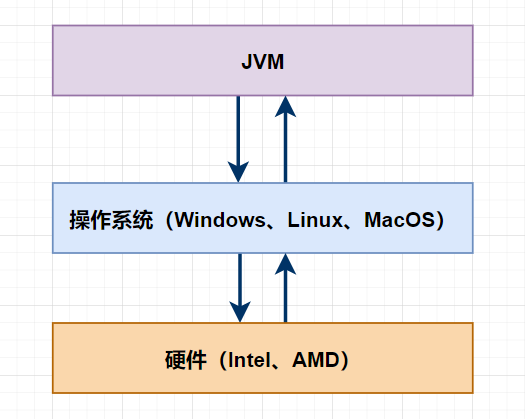
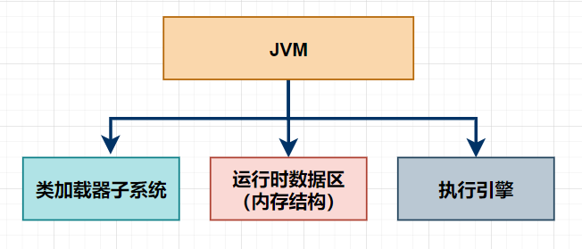
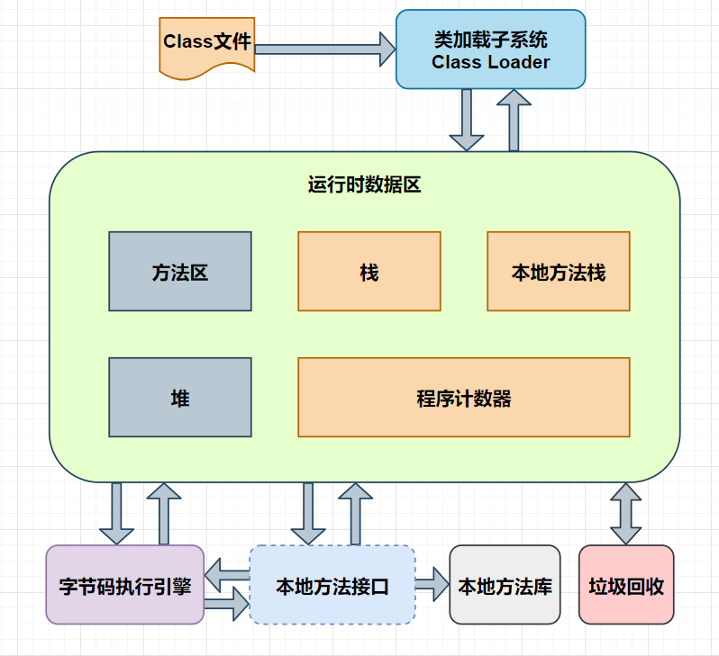
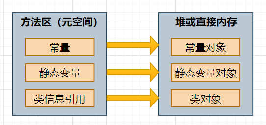
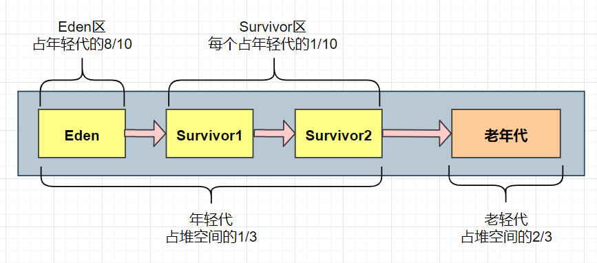
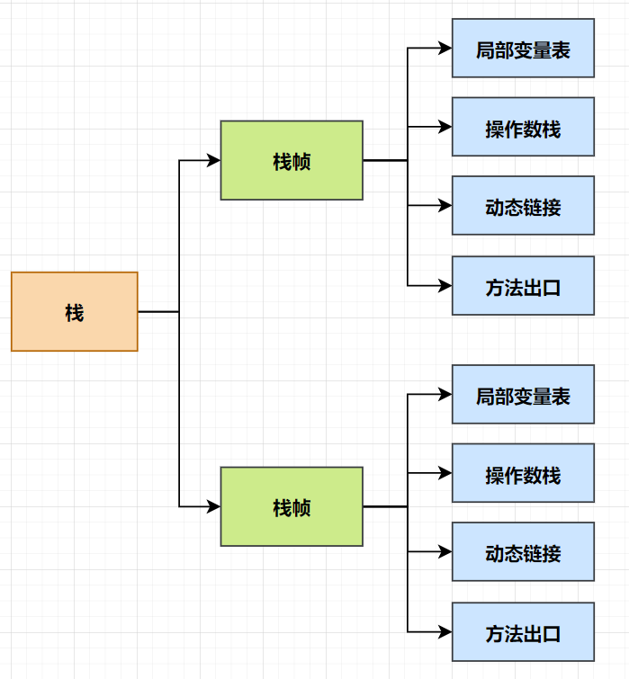
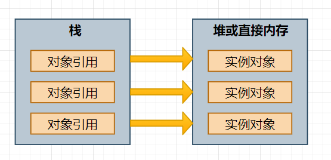
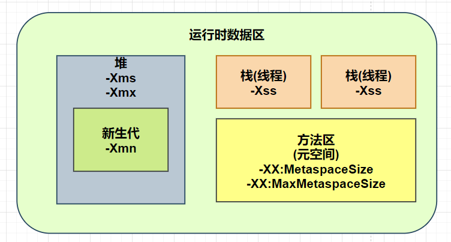

# 一、JVM的分类
这里，我们先来说说什么是VM把，VM: virtual machine，虚拟机，指的是使用软件的方式模拟具有完整硬件
系统功能、运行在一个完全隔离环境中的完整计算机系统，是物理机的软件实现。<br><br>

常用的虚拟机有：VMWare、Virtual Box, Java Virtual Machine(JVM) <br><br>

这里，我们重点聊的就是JVM，Java虚拟机, 看下图。<br>

<br>

这张图看起来还是比较简单的, JVM运行于操作系统之上，操作系统是运行在计算机硬件上的。<br>
关于JVM，其实有很多大厂开发了不同版本的JVM，比较知名的有: Sun HotSpot VM, BEA JRockit VM, IBM J9 VM,
Azul VM, Apache Harmony, Google Dalvik VM, Microsoft JVM 等等。 <br><br>

现在使用的比较多的JDK8版本就是 Sun HotSpot VM与BEA JRockit VM 合并之后开发出的JDK版本。

# 二、JVM的构成
JVM主要由三个子系统构成，分别为：类加载子系统、运行时数据区（内存结构）和字节码执行引擎。 <br>


<br><br>

为了能更好的了解JVM，我们来看下JVM的全貌。<br><br>

 <br>

当我们开发Java程序时，首先会编写.java文件，之后，会将.java文件编译成.class文件。<br><br>

JVM中，会通过类装载子系统将.class文件的内容装载到JVM的运行时数据区，而JVM的运行时数据区又会分为：
<Strong>方法区、堆、栈、本地方法栈和程序计数器</Strong>几个部分。
<br><br>

在装载class文件的内容时，会将class文件的内容拆分为几个部分，分别装载到JVM运行时数据区的几个部分。其中，
值得注意的是：<Strong>程序计数器的作用是：记录程序执行的下一条指令的地址。</Strong>
<br><br>

方法去也叫作元空间，主要包括了：运行时常量池、类型信息、字段信息、方法信息、类加载器的引用、对应的Class
实例的引用等信息。
<br><br>

在JVM中，程序的执行是通过执行引擎进行的，执行引擎会调用本地方法的接口来执行本地方法库，进而完成整个程序
逻辑的执行。
<br><br>

我们常说的来及收集器是包含在执行引擎中的，在程序的运行过程中，执行引擎会开启垃圾收集器，并在后台运行，
垃圾收集器会不断监控程序运行过程中产生的内存垃圾信息，并根据相应的策略对垃圾信息进行清理。
<br><br>

<Strong>这里，大家需要注意的是：栈、本地方法栈和程序计数器是每个线程运行时独占的，而方法区和堆是所有线程共享的。
所以，栈、本地方法栈和程序计数器不会涉及线程安全问题，而方法区和堆会涉及线程安全问题。</Strong>

## 2.1方法区（元空间）
很多小伙伴一看到方法区三个字，脑海中的第一印象可能是存储方法的地方吧。
<br><br>

实则不然，方法区的另一个名字叫做元空间，相信不少小伙伴或多或少的听说过元空间。这个区域是JDK1.8中划分出来的。
主要包含：运行时常量池、类型信息、字段信息、方法信息、类加载器的引用、对应的Class实例的引用等信息。方法区
中的信息能够被多个线程共享。
<br><br>

例如，在程序中声明的常量、静态变量和有关于类的信息等的引用，都会存放在方法区，而这些引用所指向的具体对象
<Strong>一般都会在堆中开辟单独的空间进行存储，也可能会在直接内存中进行存储。</Strong><br><br>



# 2.2 堆
堆中主要存储的是实际创建的对象，也就是会存储通过new关键字创建的对象，堆中的对象能够被多个线程共享。堆中的数据
不需要事先明确生存期，可以动态的分配内存，不再使用的数据和对象由JVM中的GC机制自动回收。
<Strong>堆JVM的性能调优一般就是对堆内存的调优。</Strong>
<br><br>

Java中基本类型的包装类：Byte、Short、Integer、Long、Float、Double、Character、Boolean类型的数据是存储在堆中的。
<br><br>

堆一般会被分成年轻代和老年代。而年轻代又会被进一步分为1一个Eden区和2个Survivor区。在内存分配上，默认的是，年轻代和
老年代的内存大小比例为1:2，Eden区和2个Survivor区的大小比例为8:1:1。
<br>


<br>

## 2.3 栈
栈一般又叫做线程栈或虚拟机栈，一般存储的是局部变量。在Java中，每个线程都会有一个单独的栈区，每个栈中的元素
都是私有的，不会被其他的栈所访问。栈中的数据大小和生存期都是确定的，存取速度比较快。
<br><br>

在Java中，所有的基本数据类型（byte、short、int、long、float、double、char、boolean）和引用变量（对象引用）
都是在栈中的。<Strong>一般情况下，线程退出或方法退出时，栈中的数据会被自动清除。</Strong>
<br><br>

程序在执行过程中，会在栈中为不同的方法创建不同的栈帧，在栈帧中又包含了：
<Strong>局部变量表、操作数栈、动态链接和方法出口</Strong><br>


<br>

栈中一般会存储对象的引用，这些引用所指向的具体对象一般都会在堆中开辟单独的空间进行存储，也有可能存储在直接
内存中。
<br>

<br>

<Strong>
注意：这里说的是这些引用所指向的具体对象一般都会在堆中开辟单独的地址空间进行存储，也有可能存储在直接内存中。<br><br>
因为在JVM中，如果开启了逃逸分析和标量替换，则可能不会再在堆上创建对象，可能会将对象直接分配到栈上，也可能不再创建
对象，而是进一步分解对象中的成员变量，将其直接在栈上分配空间并赋值。
</Strong>

## 2.4 本地方法栈
本地方法栈相对来说比较简单，就是保存native方法进入区域的地址。<br><br>

例如，在Java中创建线程，调用Thread对象的start()方法时，会通过本地方法start0()调用操作系统创建线程的方法。
此时，本地方法栈就会保存start0()方法进入区域的内存地址。

## 2.5 程序计数器
程序计数器也叫作PC计数器，只要存储的是下一条将要执行的命令的地址。

## 2.6 直接内存
直接内存，指的是使用了Java的直接内存API，进行操作的内存。这部分内存可以收到JVM的管控，比如ByteBuffer
类所申请的内存，就可以使用具体的参数进行控制。<br><br>

需要注意的是直接内存和本地内存不是一个概念。<br>

- <Strong>直接内存</Strong>比较专一，有具体的API（这里指的是ByteBuffer），也可以使用-XX:MaxDirectMemorySize参数控制
它的大小;
- <Strong>本地内存</Strong>是一个统称，比如使用native函数操作的内存就是本地内存，本地内存的使用JVM是限制不住的，使用的
时候一定要小心。
<br>

以下是直接内存和本地内存的对比表：<br>

| 对比项| 直接内存（Direct Memory）| 本地内存（Native Memory）                              |
|----------------|---------------------------------------------|--------------------------------------------------|
| 范围           | 本地内存的子集                               | 总称，包含直接内存和其他堆外内存                      |
| 分配方式       | `ByteBuffer.allocateDirect()`                | 任何 native 代码（JVM 自身、JNI、第三方库）           |
| Java API 控制  | 可通过 `-XX:MaxDirectMemorySize` 限制        | 无法直接限制（需控制线程数、Metaspace 等）            |
| 典型用途       | NIO 高性能 I/O                              | JVM 运行所需的所有堆外资源                           |
| 监控方式       | `java.nio.BufferPoolMXBean`                 | `jcmd <pid> VM.native_memory`  

# 三、JVM调优参数
在JVM中，主要是对堆（新生代）、方法区和栈进行性能调优。各个区域的调优参数如下所示。<br>
- 堆: -Xms、-Xmx
- 新生代: -Xmn
- 方法区（元空间）: -XX:MetaspaceSize、-XX:MaxMetaspaceSize
- 栈（线程）: -Xss
<br>
为了更加直观的表述，我们可以将JVM的内存区域和对应的调优参数总结成下图所示。<br>

<br>

<Strong>在设置JVM启动参数时，需要特别注意方法区（元空间）的参数设置。</Strong><br>

关于方法区（元空间）的JVM参数主要有两个：-XX:MetaspaceSize 和 -XX:MaxMetaspaceSize。
<br><br>

<Strong>-XX:MetaspaceSize:</Strong>指的是方法区（元空间）触发Full GC的初始内存大小（方法区没有固定的初始内存大小），以字节为单位，
默认21M。达到设置的值时，会触发Full GC,同时垃圾收集器会对这个值进行修改。
<br><br>

如果在发生Full GC时，回收了大量内存空间，则垃圾收集器会适当降低此值的大小;如果在发生Full GC时，释放的空间
比较少，则在不超过设置的-XX:MaxMetaspaceSiz值 或者在没设置 -XX:MetaspaceSize的值时不超过21M，适当提高此值。
<br><br>

<Strong>-XX:MaxMetaspaceSize:</Strong>指的是方法区（元空间）的最大值，默认值为-1，不受堆内存大小限制，此时，
只会受限于本地内存大小。
<br><br>

<Strong>最后需要注意的是：</Strong>调整方法区（元空间）的大小会发生Full GC,这种操作的代价时非常昂贵的。如果发现应用在
启动的时候发生了Full GC,则很有可能时方法区（元空间）的大小被动态调整了。

<Strong>
所以，为了尽量不让JVM动态调整方法区（元空间）的大小造成频繁的Full GC,一般将-XX:MetaspaceSize和-XX:
MaxMetaspaceSize设置为相同值。例如，物理内存8G，可以将这两个值设置为256M
</Strong>
<br><br>

最后，我们一起看下在物理内存8G的情况下，启动应用程序时，可以设置的JVM参数。当然，我这里给出的是一些
经验值，实际部署到生产环境时，需要经过压测找到最佳的参数值。<br>

- 启动SpringBoot
```java
java -Xms2048M -Xmx2048M -Xmn1024M -Xss512K -XX:MetaspaceSize=256M -XX:MaxMetaspaceSize=256M
-jar xxx.jar
```

- 启动Tomcat（Linux）
在Tomcat bin目录下catalina.sh文件里配置。
```java
-Xms2048M -Xmx2048M -Xmn1024M -Xss512K -XX:MetaspaceSize=256M -XX:MaxMetaspaceSize=256M 
```
- 启动Tomcat（Windows）
在Tomcat bin目录下catalina.bat文件里配置。<br>
一般来说，我们配置在IDEA的VM Options
```java
-Xms20248M -Xmx2048M -Xmn1024M -Xss512K -XX:MetaspaceSize=256M -XX:MaxMetaspaceSize=256M
```